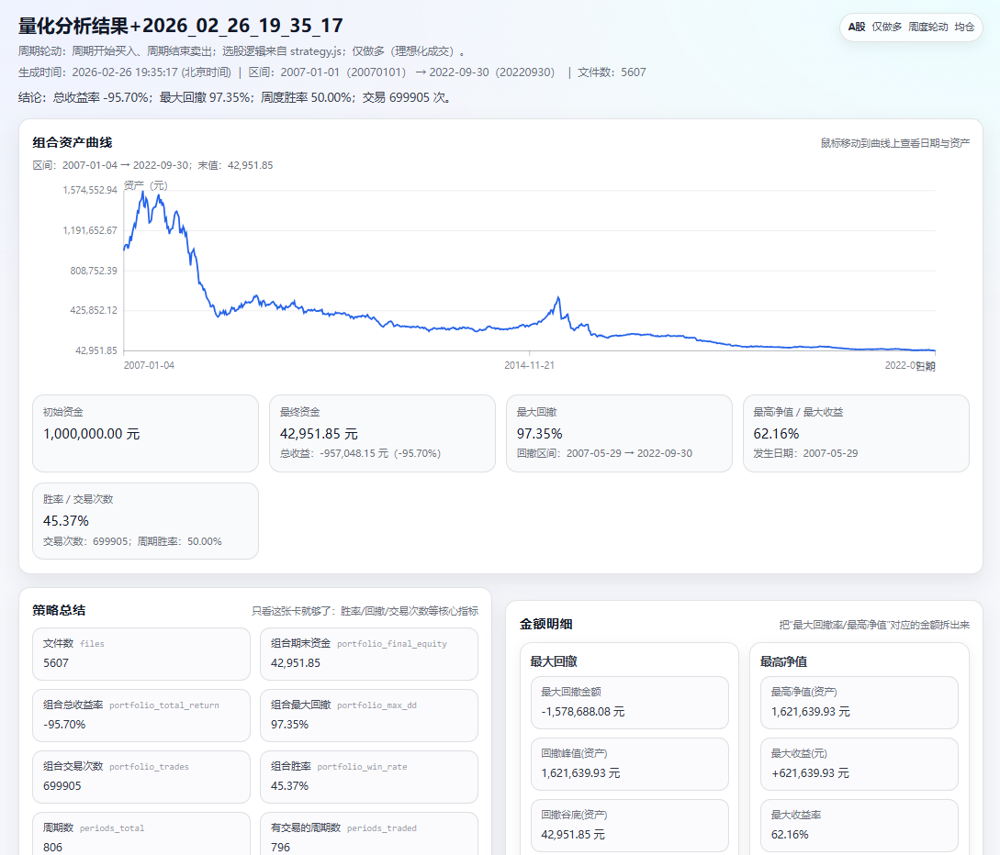

[中文](./README.md) | [English](./README.en.md)

<p align="center">
  
</p>
<h2 align="center">Stock Quant Assistant</h2>
<h1 align="center">stock-indicator-backtest</h1>
<p align="center">
  A-share periodic rotation backtester: edit <code>strategy.js</code>, run D/W/M/Q cycle trading, get an HTML report (equity curve, drawdown, win rate, etc.).
</p>

## TL;DR

- You can run it without writing any strategy code: `strategy.js` already contains a working example.
- Default behavior is simple: run backtest and output `量化分析结果+YYYY_MM_DD_HH_mm_ss.html` (Beijing time).
- Execution is idealized: no limit-up/limit-down halt simulation, no lot-size restriction.

## Report Preview

<p align="center">
  
</p>

## Quick Start (3 minutes)

1) Put CSV files under `stock/` in repo root.  
Data release (0.1.0): https://github.com/Loveyless/stock-indicator-backtest/releases/tag/0.1.0

2) Install dependencies:

`pnpm i` (or `npm i`)

3) Run backtest:

`pnpm start` (or `npm start`)

4) Success criteria:

- terminal prints `已生成报告：...`
- a new file appears in project root: `量化分析结果+YYYY_MM_DD_HH_mm_ss.html`

## Project Layout

```text
stock-indicator-backtest-node/
├─ stock/                      # your CSV data
├─ strategy.js                 # example strategy (editable)
├─ src/main.js                 # entry point
├─ STRATEGY.md                 # strategy docs entry
├─ STRATEGY_API.md             # strategy(ctx) contract
└─ STRATEGY_INDICATORS.md      # indicator API and semantics
```

## Common Commands

- Quick run: `pnpm run backtest:quick`
- Time range: `pnpm start -- --start=20211115 --end=20241231 --quiet`
- Frequency: `pnpm start -- --freq=D` (`D` overnight) / `--freq=W|M|Q`
- Sample limit: `pnpm start -- --limit=100 --quiet`
- Custom strategy file: `pnpm start -- --strategy-file=./my_strategy.js --quiet`
- Custom strategy params JSON: `pnpm start -- --strategy-params='{"minAmount":80000000}' --quiet`

## Strategy Basics

- Default strategy file is `strategy.js` in repo root.
- It must export `strategy(ctx)`.
- Return value must be picked CSV file names (e.g. `sh600000.csv`), not raw stock codes.
- Use `ctx.asOfYmd` as signal date to avoid look-ahead bias.

Read details:

- `STRATEGY.md`
- `STRATEGY_API.md`
- `STRATEGY_INDICATORS.md`

## Trading Semantics

- Long-only; buy at cycle start, sell at cycle end (`--freq=D|W|M|Q`).
- Missing buy/sell adjusted close price means skip that stock for the whole cycle.
- Fees are off by default; enable via `--fee-bps` and `--stamp-bps`.

## FAQ

- “Cannot find data directory”: ensure `stock/` exists and has `*.csv`.
- “Missing required columns”: CSV must include `股票名称`, `交易日期`, `收盘价_复权`.
- Garbled column names: try `--encoding=auto` or `--encoding=utf8`.
- No trades: strategy probably returned wrong keys (code vs file name).
- Too few results: remove `--limit` and widen `--start/--end`.

## More Docs

- Workflow: `docs/workflow.md`
- Data contract: `docs/data-contract.md`
- Data download & checksum: `docs/data.md`
- Report fields: `docs/report.md`
